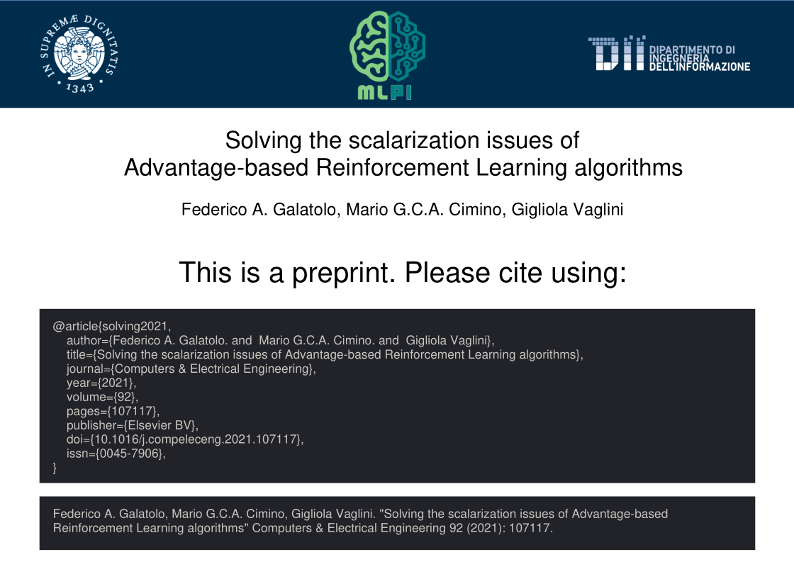

# mlpi-citation-page

WebApp for generating [MLPI](http://mlpi.ing.unipi.it/)-branded **citation pages** like this:



It **just** requires the paper **DOI** and it **automatically** fetches the paper **metadata**.


**The WebApp is available [here](https://galatolofederico.github.io/mlpi-citation-page/)**


## Local Deploy

To deploy it locally you have to clone this repository

```
git clone https://github.com/galatolofederico/mlpi-citation-page.git
cd mlpi-citation-page
```

And install the dependencies

```
npm install
```

To start a local development server run

```
npm start
```

To build the production version run

```
npm run build
```

## CLI interface

you can use the CLI interface by running

```
node cli.js
```

for the arguments list run

```
node cli.js --help
```

The builded webapp will be available in `./dist`

## Contributions and license

The code is released as Free Software under the GNU/GPLv3 license. Copying, adapting and republishing it is not only allowed but also encouraged.

For any further question feel free to reach me at federico.galatolo@ing.unipi.it or on Telegram @galatolo